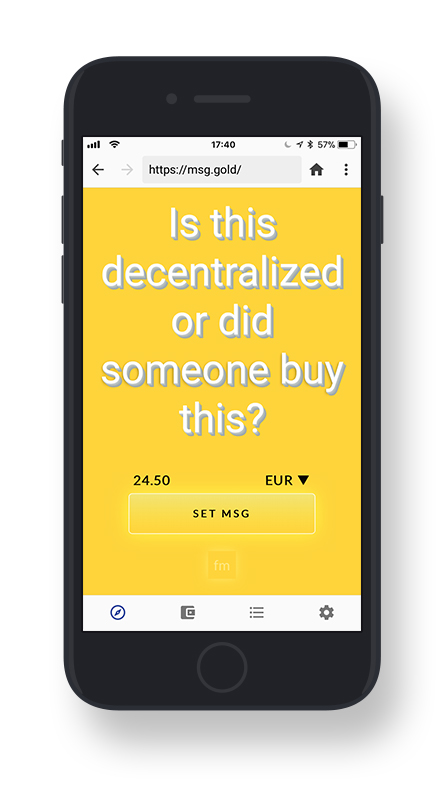
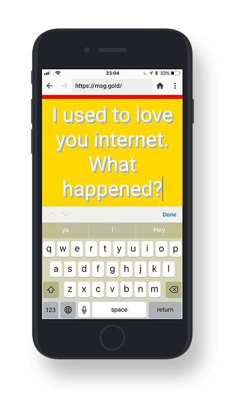
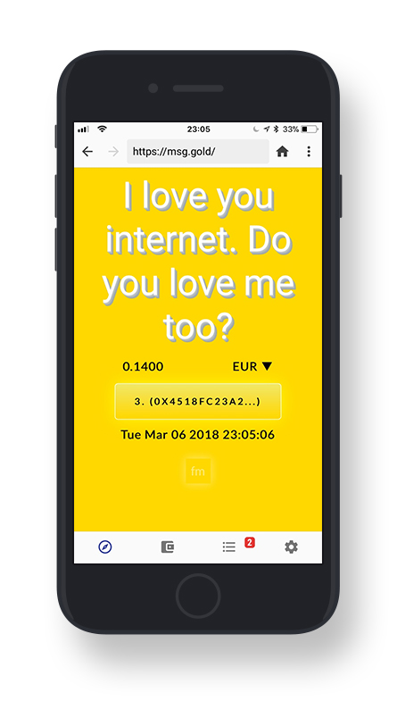
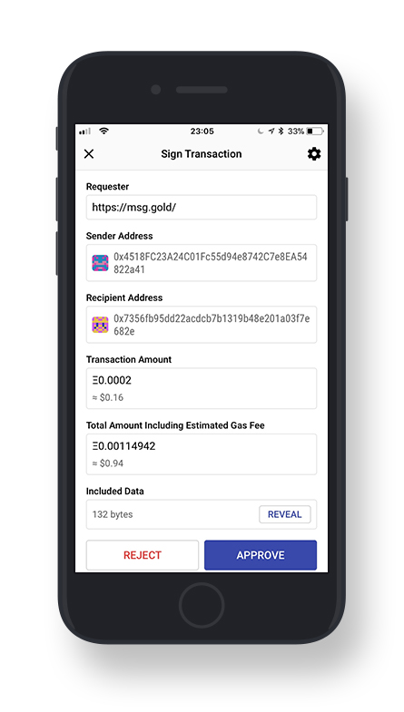

# 
!!! TEST PHASE: ROPSTEN TESTNET !!!

# 
🔖 MsgX (Gold) ✨

# 
→ <a href="https://msg.gold">https://msg.gold</a>

## 
Set a golden message to the internet.

It will be stored forever.

# 
How does it work?

 

## 
The current golden message to the internet as well as its count, it's date and author, can be seen by anyone. (No connection to the blockchain required.)

 

## 
Editing the current one or setting a new golden message to the internet increases the price by 0.00001 ETH. (Requires a connection to the blockchain.)

 

## 
All previous golden messages are accessible forever and can be called for free using the app (or directly via the smart contract).

 

## 
The Genesis message to the internet "Is this decentralized or did someone buy this?" was 10000000000000 Wei which is 0.00001 ETH and around 0.001 USD.

#  
How to connect to the blockchain?

## 
Desktop

### 
On desktop devices the great Fox and his Metamask provide you access to the network :

    

# 
 Set up and browse to <a href="https://msg.gold">https://msg.gold</a>.

## 
Mobile

### 
On mobile devices Chiper Browser grants you access to the blockchain :

</img>

     

# 
 Set up and browse to <a href="https://msg.gold">https://msg.gold</a>.

# Status

## Smart Contract

| branch      | address                                    |
|-------------|--------------------------------------------|
| master      |                                            |
| development | 0x3f6c23909f65856dc1c656dab013d5a4cac54f3f |